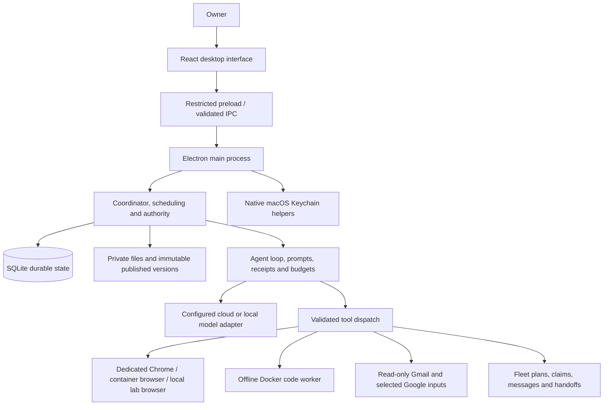

# Taskivra AI

Current entrypoints and review implementation: [capabilities and verification](docs/improvements/CURRENT-CAPABILITIES.md), [102-item implementation ledger](docs/improvements/ledger.json). Historical planning and review records remain dated reference material.

**One objective. Your agents, working together.**

Taskivra AI is a Mac-first desktop workspace for running and supervising AI agents. Agents have private files and their own browser sessions. They can request missing information, wait for your response, resume saved work, publish exact file versions, and collaborate through shared tasks and messages. You remain in control of their access, budgets, browser handoffs, and execution.

The separate **Fleets** feature turns one objective into a bounded team: a lead proposes roles and work, specialists claim eligible items, independent work can run concurrently, agents exchange findings, and the lead combines their reports.

This repository contains the implemented application, runtime workers, tests, a synthetic local training website, and the planning and research records behind the product.

> **Status: local pre-release, version 0.10.0.** The application and package still display **Agent Workspaces**, and retain that name for existing storage and internal identifiers. Taskivra AI is the repository/product name; a complete application rebrand has not been applied. Apple Silicon Mac is the validated development platform. Windows, Linux, Intel Mac, clean-machine installation, public signing, notarization, and automatic updates are not validated release targets.

## Contents

- [Beginner guide](#beginner-guide)
- [What you can do](#what-you-can-do)
- [Current verification and limits](#current-verification-and-limits)
- [Requirements](#requirements)
- [Install and start](#install-and-start)
- [Connect a model](#connect-a-model)
- [Set up browsers](#set-up-browsers)
- [Set up isolated code execution](#set-up-isolated-code-execution)
- [Connect Gmail and selected Google files](#connect-gmail-and-selected-google-files)
- [Use tasks, files, and collaboration](#use-tasks-files-and-collaboration)
- [Run a fleet](#run-a-fleet)
- [Architecture](#architecture)
- [Data, credentials, and recovery](#data-credentials-and-recovery)
- [Development and checks](#development-and-checks)
- [Build a local Mac application](#build-a-local-mac-application)
- [Troubleshooting](#troubleshooting)
- [Project documents and implementation history](#project-documents-and-implementation-history)
- [Contributing and licensing](#contributing-and-licensing)

## Beginner guide

New to the project? Start with the **[complete beginner guide](https://taskivra-ai-guide.vercel.app)** or **[open/download the linked PDF](https://taskivra-ai-guide.vercel.app/Taskivra-AI-Guide.pdf)**. The guide assumes no prior knowledge of this application: it explains the terminology and screens, Mac setup, model connections, creating an agent, giving it a task, supplying files, answering requests, browser control, results, collaboration, and Fleets.

The version 0.10.0 edition includes 25 chapters, a clickable contents page and PDF bookmarks, plus eight step-by-step examples: competitor research, CSV analysis, a read-only Gmail brief, supplied-code review, website usability review, decision research, a fleet reviewing published files, and the fictional local website lab. Each example includes agent instructions, task inputs, what a useful result should contain, numbered steps, review questions, and limitations. Examples are instructional; they do not claim completed live runs.

The website hosts documentation and the PDF. The application runs locally on your Mac. A repository copy of the PDF is in [output/pdf/Taskivra-AI-Guide.pdf](output/pdf/Taskivra-AI-Guide.pdf); [guide sources and regeneration instructions](docs/guide/README.md) keep the web and PDF editions together.

## What you can do

| Capability | Current behavior |
| --- | --- |
| Private agents | Each agent has its own managed workspace, task history, and browser session with multiple tabs. |
| Human requests | Agents can ask for files, clarification, sign-in, or a reviewed change of scope, then wait and resume from saved progress. |
| Browser handoff | Inspect progress, take exclusive control of an agent's browser, sign in yourself, and return control with a fresh page observation. |
| Isolated code | Run Python, Node.js, or shell payloads in disposable offline containers over approved file snapshots. |
| Shared files | Publish immutable versions within a project; consuming tasks pin exact versions rather than reading a moving file. |
| Coordination | Use shared task awareness, dependency checks, scoped peer messages, and explicit artifact handoffs. |
| Fleets | Submit one objective and bounded team limits; the lead plans and specialists claim work, exchange findings, and hand reports back automatically. |
| Model connections | Configure OpenAI, Anthropic, Ollama, and compatible hosted or local gateways, with immutable saved connection revisions. |
| Guided workflows | Start competitor comparisons, two-CSV analysis, code-file reviews, website reviews, unread-mail briefs, or decision research. Save reusable workflows. |
| Google inputs | Use read-only Gmail and explicitly selected Drive files or Sheets ranges, with account verification and source receipts. |
| Results | Preview exact outputs, inspect structural and coverage checks, accept a result, request changes, and export supported reports. |
| Recurring work | Schedule eligible read-only workflows with limits and optional in-app change alerts. The app must be running. |
| Recovery | Pause/stop work, retain checkpoints and uncertain-call accounting, inspect recovery incidents, and create verified local backups. |

Examples include comparing approved company pages, producing a report from two CSV files, reviewing supplied code, preparing a read-only email brief, and coordinating a team to review published evidence. A separate local website lab exercises fleet coordination through real browser interactions with fictional data.

## Current verification and limits

Application mechanics and live model performance are different claims:

- Publication checks on **1 October 2026** passed type checking, the production build, and **663 tests**, with **18 optional checks skipped and 0 failed** under Electron: 681 tests total. Optional browser, container, Keychain, and paid-provider checks need their own explicit setup and evidence.
- Scripted integration checks exercise the actual coordinator and agent loop, including two overlapping workers, exclusive claims, messages, exact report handoffs, and final synthesis. They demonstrate coordination mechanics, not the intelligence of a hosted model.
- The real paid local-website fleet assessment is **paused and incomplete**. It has not produced a final report, a verified model-discovered flaw, or demonstrated simultaneous live specialist work. Earlier real browser checks passed, but the final navigation-readiness change still needs its dedicated real-browser harness rerun.
- Provider fixtures verify supported protocol translations and failure handling. Saving a model connection does not certify that the chosen remote account, local server, or model works.
- Result checks validate structure, receipt membership, and disclosed coverage. They do not certify factual accuracy, calculation correctness, or market fit.

See [the current Fleet lab status](docs/fleet-lab-implementation-status.md) for the exact tested boundary and incomplete live-run record. Historical status documents describe their own release, not necessarily the current interface.

## Requirements

| Requirement | Needed for |
| --- | --- |
| Apple Silicon Mac | The currently validated desktop and local packaging path. Native helpers use macOS frameworks. |
| Node.js **24.14.0 or newer**, with npm | Installing source dependencies, building, and development commands. |
| Apple Command Line Tools / Clang | Compiling the native Keychain and Chrome bridge helpers. Install with `xcode-select --install` if missing. |
| A configured model API or local model server | Live agent tasks. No model or account is included. |
| Google Chrome at `/Applications/Google Chrome.app` | The dedicated native browser backend for ordinary tasks. |
| Docker Desktop, running | Isolated code and the optional container browser. Neither is installed by the application. |
| A Google Desktop OAuth client | Optional Gmail or selected Drive/Sheets connections. Separate account consent is required. |

Container images and dependency downloads need additional disk space. Code-image setup enforces at least **8 GiB free host disk**; local app packaging enforces at least **2 GiB**. These are operation-specific minimums, not a complete storage estimate. Browser images and Docker's own storage can require more space.

## Install and start

```sh
git clone https://github.com/Ritesh102000/Taskivra-Ai.git
cd Taskivra-Ai
npm ci
```

Build the local native helpers. These commands compile repository source; they do not configure accounts, read credentials, or download models:

```sh
npm run model:setup
npm run gmail:setup
node packages/google-workspace/setup.mjs
npm run browser:native:setup
```

Start the development application:

```sh
npm start
```

`npm start` builds the application and opens Electron. The interface currently says **Agent Workspaces**. Launching does not provision Docker images, load the Chrome extension, connect Google accounts, or make a model ready automatically.

Persistent data defaults to:

```text
~/Library/Application Support/Agent Workspaces
```

Use **Settings → Models and providers** to configure your model before starting live work. For a first task, choose a workflow, review its permissions and limits, and save its draft before running it. Simulation and scripted fixtures are labeled separately from live execution.

## Connect a model

The application supports four protocol families:

| Connection type | Suitable services | Configuration |
| --- | --- | --- |
| OpenAI Responses | OpenAI API | Exact model ID, API credential, pricing and limits. |
| Anthropic Messages | Claude API | Exact model ID, API credential, pricing and limits. |
| Ollama chat | A separately running Ollama server | Local endpoint and explicit model tag; a local key can be omitted. |
| OpenAI-compatible Chat Completions | Compatible hosted gateways or self-hosted servers | Correct endpoint, exact model ID, credential if required, declared pricing and limits. |

The settings form includes presets for OpenAI, Claude, Ollama, OpenRouter, Together, Groq, LM Studio, and LiteLLM. Presets are setup conveniences; they are not a guarantee for every model exposed by those services.

1. Choose the protocol and supply the server endpoint and exact model identifier.
2. Enter any required API key through the application. Keys go to macOS Keychain.
3. Supply input/output limits, billing mode, and declared prices for metered connections.
4. Save the connection and select it when preparing a task or fleet.

Remote endpoints require HTTPS. HTTP is permitted only for canonical loopback addresses. A local gateway that forwards to a paid cloud service should use metered billing, rather than declaring itself free.

The current tool protocol expects text and **at most one valid client tool call per turn**, with usable model identity and token usage. Models that require proprietary built-in tools or reasoning-state replay need additional integration. An API subscription/account or installed local server is your own dependency; the app does not turn a ChatGPT or Claude consumer subscription into API access.

Tasks pin immutable connection revisions. Editing a connection does not silently change an existing task's model, endpoint, or limits. Keys for historical revisions can be repaired separately.

Money and token reservations are checked before dispatch. Unknown outcomes retain their reservations; model failures and uncertain actions are not blindly retried. Declared-price accounting is a local bound, not a guarantee of an external provider's invoice. Local billing records zero provider fees and does not measure hardware or electricity costs.

Details: [model connections](docs/phase8-providers.md) and [the original OpenAI/Keychain adapter](packages/model-adapters/README.md).

## Set up browsers

Three browser paths serve different purposes:

| Backend | Purpose | Login persistence | Main boundary |
| --- | --- | --- | --- |
| Dedicated desktop Chrome | Ordinary agent browsing and human sign-in | Separate local Chrome profile per agent | Profile separation on the Mac; normal host network. |
| Container browser | Optional isolated browsing with managed artifact transfers | Optional encrypted profile checkpoints | Docker worker plus destination-filtering egress. |
| Local lab browser | The bundled synthetic training website | Temporary; storage clears when closed | Separate Electron sessions restricted to the app-owned local lab. |

### Dedicated Chrome

1. Install Chrome and build the native helper with `npm run browser:native:setup`.
2. Open the selected agent's **Browser setup**, prepare its dedicated profile, and choose **Open Chrome setup**.
3. In that agent's Chrome window, open `chrome://extensions`, enable **Developer mode**, and choose **Load unpacked**.
4. Select this checkout's `extensions/agent-browser` folder. Return to the app and refresh the connection status.
5. Use **Take control** for sign-in and MFA in the actual Chrome window. Choose **Return to agent** when finished.

Extension setup is required once per agent profile. After changing extension source, close the task browser, reload the extension on its Extensions page, then reopen the browser.

Agent operations use managed tabs and do not rely on the Mac's global mouse or keyboard. The human can continue using their own browser while agents operate their separate sessions. Explicit inspection or takeover may bring the agent window forward. Human control prevents agent page reads, previews, and inputs; credentials are not entered through task messages.

Profiles are separate from personal Chrome, but this backend is not a container or host-network sandbox. It supports up to six managed tabs per session. Managed artifact upload/download is currently unsupported; a manual Chrome download does not automatically become a task file. Websites can still reject sign-in or require additional checks.

Details: [native Chrome setup, ownership, and limitations](packages/native-browser/README.md).

### Optional container browser

```sh
npm run browser:check
npm run browser:setup
```

This setup currently depends on the retained, pinned Phase 0 base images. It is **not a complete fresh-clone browser provisioning path**. Missing base images stop setup; it does not silently pull replacements. Follow the [runtime documentation](packages/browser-runtime/README.md) and [Phase 0 decision record](docs/phase0/decision-record.md) before enabling this backend.

Container profiles and desktop Chrome profiles are different stores. Switching backends requires closing the current session and does not migrate cookies.

## Set up isolated code execution

Code runs inside disposable Docker containers, with no task-time network and no access to personal browser profiles, model keys, the host filesystem, or the Docker socket. Approved inputs are streamed as verified snapshots; the runtime verifies exported files before committing new versions.

With Docker Desktop running, check readiness:

```sh
npm run code:check
```

For a fresh Apple Silicon machine, explicitly provision the portable standard-library base and runtime image:

```sh
node packages/code-runtime/setup.mjs --build --bootstrap-base --allow-network
npm run code:check
```

This command intentionally permits network access **during image provisioning**. Agent payload jobs remain offline. If Docker is not on your command path, set `AW_DOCKER_PATH` to its executable, such as `/Applications/Docker.app/Contents/Resources/bin/docker`.

`npm run code:setup` is the older offline build path and requires the exact retained Phase 0 base. It cannot provision that missing base on a fresh checkout.

The standard image supports Python and Node standard libraries and shell execution. Additional packages require an explicit reviewed recipe with pinned versions and integrity checks. The application does not let a model install arbitrary dependencies automatically. PDF/XLSX extraction uses a separately reviewed document recipe; OCR and macro execution are not supported.

Default code limits include one CPU, 1 GiB memory, a 120-second payload deadline, and bounded logs and file export. Writable work/output areas are separate from inputs. An execution succeeds only after the payload exits cleanly and exports pass verification. Stop interrupts the owned container and fences later output commitment.

Details: [code runtime](packages/code-runtime/README.md), [portable provisioning](docs/phase7-release-foundations.md), and [document inputs](docs/phase7-documents.md).

## Connect Gmail and selected Google files

Google connections use an owner-imported **Desktop OAuth client JSON**, system-browser consent, an exact-account check, and native Keychain token storage. The system browser is used for consent; agents continue their tasks through read-only API tools.

### Gmail

1. Create/select your project in Google Cloud Console and enable **Gmail API**.
2. Configure the consent screen and intended test users where applicable.
3. Create an OAuth client of type **Desktop app** and download its JSON.
4. Create an agent, prepare **Review unread Gmail** with the exact intended account and your priorities, and save the live task with a configured model. A saved live Gmail task is required before the connection can start.
5. In **Settings → Gmail connection**, select that task, import the JSON, and choose **Connect Gmail** for the intended account.
6. Complete consent in the system browser, then verify/bind the account to the relevant project. Resolve readiness checks and run the saved task.

The baseline workflow reads bounded headers and snippets, preserves unread status, and discloses pagination/truncation. A separately opted-in detailed task can search, read selected plain-text threads, and import supported selected attachments. HTML and remote content are excluded from detailed reads.

No Gmail tool sends, archives, deletes, or marks messages read. Connecting an account does not establish that every unread message has been reviewed. OAuth expiry or revocation can require reconnection.

See [the Gmail setup guide](docs/phase5/gmail-setup.md) and [detailed review limits](docs/phase7-google-inputs.md).

### Drive and Sheets

Drive/Sheets use a separate read-only connection and project account approval. Enable the relevant APIs and import a Desktop client through the Google-inputs settings flow.

The owner selects one supported file or a finite named-sheet A1 range. The app imports an immutable local snapshot with source identity, retrieval time, hash, and coverage. It does not continuously sync or modify the source. Google Docs are imported as plain text; Sheets become bounded CSV values.

The current OAuth scope permits broad Drive reads. Resource selection is enforced by the application broker, not a provider-issued per-file grant. Gmail credentials do not grant Drive access. See [selected Google inputs](docs/phase7-google-inputs.md).

## Use tasks, files, and collaboration

### Ordinary task flow

1. Choose a project and agent, then prepare a task or guided workflow.
2. Define the objective, allowed access, output expectations, model revision, and limits.
3. Import required files and review readiness. Starting live work authorizes model calls within the saved configuration.
4. Inspect progress. Answer requests or take browser control when needed.
5. Review the exact result and its coverage checks; accept it or request changes.

An executing agent has one active task at a time. Waiting, paused, failed, and completed states are distinct. Reopening the app does not grant automatic permission to replay interrupted live work.

### File-request flow

```text
Missing input → named request → owner selects files → validation
             → accepted slots persist → remaining slots are resolved
             → one eligible continuation resumes saved work
```

Wrong files remain blocked rather than counting as supplied. Already accepted inputs survive partial replacement and restart. A file response cannot override an owner pause or cancellation. Reduced scope requires owner acceptance.

Private file versions are available only through the task's authorized workspace and selected inputs. Agents cannot use arbitrary host paths. Default import bounds include 100 MiB per file, 250 MiB per batch, and 32 files per batch; format-specific limits can be tighter.

### Publishing and peer handoffs

```text
Private output → publish immutable project version → authorized peer selects it
               → peer pins that exact version → private peer work/output
```

Later publications do not change inputs already pinned by a task. General coordination exposes scoped summaries and references, rather than automatically sharing private prompts, browser observations, or unpublished files. Task dependencies are checked for cycles and incomplete upstream work.

Fleet messages additionally carry bounded finding text inside that fleet's scope. Exact published reports and source receipts establish the handoff record; a message alone is not a verified finding.

### Results and recurring work

Results retain exact version identities and distinguish structural checks from human acceptance. Supported Markdown/plain-text reports export to PDF or DOCX; supported CSV exports to XLSX with literal text cells. Oversized or unsupported content uses exact-original export instead of silently clipped formatted output.

Eligible read-only workflows can become routines with per-run/monthly caps and no overlap. Missed or interrupted occurrences are not blindly replayed. Optional change alerts compare an exact completed output with an earlier accepted baseline; they detect content differences, not verified changes in the outside world. Imported source snapshots do not refresh automatically. Scheduling depends on this Mac and app being available.

## Run a fleet

The current Fleets screen replaces the earlier fixed three-reviewer creation screen. Existing review tasks/results remain readable.

### One-objective workflow

```text
Objective + selected models + limits
          ↓
Lead creates roles, work items, and dependencies
          ↓
Specialists exclusively claim eligible items
          ↓
Independent items run concurrently within limits
          ↓
Scoped messages + exact reports + source receipts
          ↓
Lead revises the plan when necessary
          ↓
Combined result for owner review
```

The app provides durable coordination and limits; the model determines the quality of planning and analysis. Roles are created incrementally, completed report versions are staged for dependent tasks, and waiting leads release browser capacity. Handoffs do not reset budgets.

### Mode 1: Review published files

Publish supported evidence into a project, open **Fleets**, choose **Review published files**, select exact versions, and enter one objective. Choose lead/worker model connections and team/task limits. **Save draft** makes no model calls; **Start fleet** begins the bounded workflow.

This mode reviews selected text evidence and fleet reports. It has no live browser, network target, or code execution. Potential findings must disclose those coverage limits. Inputs are limited to eight selected files, 64 KiB each and 256 KiB total.

### Mode 2: Test local website

1. Open **Fleets**, select **Test local website**, and choose **Start training website**.
2. The app starts and verifies its own fictional **Harbor Desk** site at `http://127.0.0.1:4318/`.
3. Enter a testing objective, select configured models, review limits, and save/start the fleet.
4. Inspect each agent's progress and real lab browser. Use pause, takeover, clarification, or stop as needed.
5. Review receipts, exact reports, and the combined result if the run completes.

Agents begin logged out with the website URL. They can discover public pages and self-register fictional accounts if offered. The fleet is not supplied source code, privileged accounts, or a private answer key. The lab source is included in this repository for development, but is not attached to the running agents as input.

The lab browser needs neither a Chrome extension nor Docker. Each agent has an independent temporary Electron session. Closing it clears storage, so durable task progress does not imply durable lab login state.

| Lab tool | What it does |
| --- | --- |
| `lab_open`, `lab_observe`, `lab_action`, `lab_close` | Real page navigation/observation and actions using current opaque DOM controls. |
| `lab_command` | One bounded HTTP request, using a small `curl`-shaped JSON argument list, to the verified local site with that agent's synthetic cookies. It does not start a host shell or execute the Mac's curl program. |
| `code_execute` | Offline calculations or formatting over permitted reports from the same fleet, inside the existing code container. Docker/image readiness is required. |

The lab is a fixed local training environment. It does not provide arbitrary public targets, unrestricted PC control, or a general networked terminal. Implementation assets/control routes are excluded from agent tools. Another process occupying port 4318 is refused rather than adopted as the lab.

### Fleet limits and controls

Default team settings are four agents including the lead, two concurrently working tasks, eight work items, three plan revisions, $5 declared model spend, 100 model calls, 500,000 tokens, and 1,800 combined active seconds. Defaults are editable within validated bounds; they do not authorize unlimited work.

Per-task defaults are $2 spend, 30 model calls, 50 tool steps, 150,000 tokens, and 600 active seconds. Both team and task limits apply, along with workspace capacity. Waiting time is distinct from active execution time.

**Pause fleet** retains saved progress and closes lab browsers. **Stop fleet** ends execution and preserves the historical work. Restart, sleep, or backup leaves interrupted work requiring explicit review/resume. Unknown model calls retain budget reservations.

See [Fleet mechanics](docs/fleet-implementation-status.md) and [local-lab implementation and verification](docs/fleet-lab-implementation-status.md).

## Architecture

The desktop's main process is the trusted coordinator. Models propose tool calls; the coordinator validates task ownership, scope, limits, and the current execution lease before dispatch.



Private browser sessions and offline code execution are separate services. Browser identity does not grant access to container files or provider credentials. Tool outputs, webpages, uploads, and peer messages remain untrusted task data.

| Directory | Responsibility |
| --- | --- |
| `apps/desktop/main/` | Electron lifecycle, validated owner controllers, preload bridge, native dialogs, and lab browser runtime. |
| `apps/desktop/renderer/` | React interface for tasks, projects, files, browsers, requests, results, models, routines, recovery, and fleets. |
| `packages/contracts/` | Shared types, command schemas, protocol limits, and validation. |
| `packages/coordinator/`, `packages/persistence/` | Durable state, migrations, scheduling, leases, checkpoints, and restart behavior. |
| `packages/agent-loop/`, `packages/model-adapters/` | Prompt assembly, model protocols, budget accounting, history fitting, receipts, and tool selection. |
| `packages/artifacts/`, `packages/requests/`, `packages/collaboration/` | Verified files, human requests, visibility, dependencies, and handoffs. |
| `packages/browser/`, `packages/browser-runtime/`, `packages/native-browser/` | Browser ownership/service, container backend, and dedicated Chrome transport. |
| `packages/code/`, `packages/code-runtime/`, `workers/code/` | Code service, container admission, payload supervision, and verified export. |
| `packages/fleet/`, `packages/local-lab/`, `labs/harbor-desk/` | Fleet coordination and the app-owned synthetic website. |
| `packages/projects/`, `packages/workflows/`, `packages/routines/` | Project scope, reusable procedures, recurring dispatch, and comparisons. |
| `packages/results/`, `packages/report-export/`, `packages/documents/` | Output review, structural checks, formatted exports, and bounded extraction. |
| `packages/recovery/`, `packages/task-recovery/` | Backup/restore and bounded transient-read recovery. |
| `packages/gmail/`, `packages/google-workspace/` | OAuth, account checks, and selected read-only imports. |
| `extensions/agent-browser/` | Reviewed Chrome command surface and native messaging. |
| `containers/`, `workers/browser/` | Explicit image recipes, browser worker, egress policy, and synthetic fixtures. |
| `tests/`, `scripts/`, `spikes/phase0/` | Regression suites, build/package tools, and historical feasibility probes. |
| `docs/` | Release records, research, decisions, and capability-specific documentation. |

## Data, credentials, and recovery

SQLite stores tasks, runs, leases, requests, events, model-call accounting, receipts, project membership, and fleet state. Managed directories retain immutable artifacts and approved workspace revisions. Local application state is separate from this source checkout.

- Model keys and Google client/token records use native macOS Keychain services. They are not part of Git, model messages, or portable backups.
- Browser profiles are outside model-visible file workspaces. Native Chrome manages its own profile storage; container-profile persistence uses encrypted checkpoints.
- An owner-supplied file or task message can itself contain sensitive data. The app does not automatically redact all such content. Hosted models receive the task context and authorized content needed for their requests.
- Backups include private task history and user files and are **not encrypted or content-redacted**. Keep them private. Hashes and integrity checks detect corruption, rather than authenticating who created the backup.
- Restore verifies the backup into a new location and refuses replacement of an existing destination. Credentials and browser profiles are excluded. Restored tasks/routines require review and explicit reactivation.
- Pause, stop, restart, and generation fencing prevent late operations from silently continuing under stale authority. Unknown external outcomes remain visible instead of being replayed.

Automatic recovery is narrow: transient browser reads have durable bounded retry allowances. Login/MFA, paid model calls, uncertain navigation, clicks, and other writes are outside automatic replay. Recovery cannot guarantee that every website or model failure can be repaired autonomously.

Details: [release/recovery foundations](docs/phase7-release-foundations.md) and [read recovery and alerts](docs/phase8-recovery-alerts.md).

## Development and checks

Core checks:

```sh
npm run typecheck
npm run build
npm run test:electron
```

The Electron suite exercises persistence with the same bundled Node/SQLite runtime used by the application. Default checks use temporary data, scripted models, and synthetic fixtures. They do not enable paid model tests or read the production owner's Keychain credentials.

Focused suites:

```sh
npm run test:fleet:electron
npm run test:improvements:electron
npm run test:phase8:electron
```

`npm test` also runs host-Node suites and the Python Phase 0 checks. Historical feasibility checks can depend on local runtime prerequisites, so a missing optional environment is not evidence that a feature passed.

Container, real Chrome, Keychain, and paid-model tests are separate opt-ins documented by the relevant runtime. Read their requirements and limits before enabling them. Skipped checks are not live proof. Test-created local data, logs, screenshots, and generated builds are excluded from Git.

When contributing, preserve exact input/output identities, scope validation, owner control, lease/generation checks, and uncertain-call reservations. Add tests for meaningful failure boundaries rather than claiming live provider success from mocks.

## Build a local Mac application

Build the native helpers listed in installation, then:

```sh
npm run build
node scripts/package-mac.mjs --check
npm run package:mac
```

The default output is:

```text
dist/packages/Agent-Workspaces-0.10.0-arm64-local/
  Agent Workspaces.app
  package-manifest.json
```

The builder requires an Apple Silicon Mac and installed Electron dependencies. It refuses an existing output directory; use a new explicit destination for another package:

```sh
node scripts/package-mac.mjs --out /absolute/path/to/a-new-package-directory
```

Packaging verifies an explicit resource inventory and source hashes, includes the compiled helpers and extension, and repairs the copied bundle with an **ad-hoc local signature**. It is not Developer ID signed or notarized. It bundles neither personal app data nor Docker images, installed local models, accounts, or a general dependency installer. No ready-to-install public release is implied by this source repository.

## Troubleshooting

| Problem | What to check |
| --- | --- |
| No model connection / task will not start | Build the model helper, configure the selected connection, check its saved revision/key, and review readiness and limits. Saving a preset alone is insufficient. |
| Model server rejects tool calls | Confirm the selected protocol, exact model ID, supported single-tool response shape, token usage, and configured ceilings. Universal model compatibility is not implemented. |
| Chrome shows disconnected | Check the extension in the correct agent profile, reload it after source changes, and allow a reconnect interval. Personal Chrome is not the agent session. |
| Gmail sign-in rejected in an embedded browser | Use the supported Desktop OAuth flow. Ordinary Chrome may improve login compatibility, but provider acceptance is not guaranteed. |
| Google connection has the wrong account or expired consent | Verify the exact account/project binding and reconnect through the system-browser flow; do not enter credentials into a task. |
| Code setup says the pinned base is missing | Use the explicit portable `--bootstrap-base --allow-network` provisioning command. Check Docker readiness and disk space. |
| Optional container browser cannot build | Its Phase 0 base images are a separate unresolved fresh-machine setup dependency. Use native Chrome where appropriate. |
| File request stays blocked | Inspect the named slot's format/validation result and replace only rejected inputs. Owner pause/cancellation still takes precedence. |
| Training website will not start | Another service may own port 4318. The app refuses an unverified server; it does not adopt or terminate unrelated processes. |
| Fleet keeps waiting or reaches a limit | Inspect dependencies, claims, model/tool errors, and settled plus reserved usage. Review incomplete work before deciding to resume. |
| Formatted export is unavailable | Check supported format and complete coverage bounds. Export the exact original when a formatted version would be partial. |
| macOS asks for Keychain access | Review and complete the system prompt directly. Do not share the Mac password or paste it into tasks. Rebuilding an app can change how macOS identifies it. |

## Project documents and implementation history

Read the original planning baseline in this order:

1. [Architecture](architecture.md)
2. [Product design](design.md)
3. [Implementation plan](implementation-plan.md)
4. [Interactive design preview](design-preview.html)

`design-preview.html` is a planning mockup, not the running application. The original plan includes recommended technologies and provisional defaults. Its confirmed starting choices were **Mac first**, **cloud model APIs first**, and **isolated containers for code**. Later implementation records document local providers, native Chrome, workflows, and Fleets; they do not make every earlier proposed feature complete.

| Milestone | Main scope |
| --- | --- |
| Phase 0 | Model, browser, container, storage, and credential feasibility/decision records. |
| Phase 1 | Desktop shell, durable state, task controls, and labeled simulation. |
| Phase 2 | Private/shared files, immutable versions, validation, and storage boundaries. |
| Phase 3 | Container browser service, viewer, sessions, and handoff. |
| Phase 4 | Offline isolated code execution and verified exports. |
| Phase 5 | Live model loop, durable user requests, continuation, and read-only Gmail. |
| Phase 6 | Shared awareness/handoffs and dedicated native Chrome browsing. |
| Phase 7 | Projects/workflows/results, routines, Google inputs, documents, backup, and local release foundations. |
| Later Phase 8 records | Configurable providers, quality/export checks, recovery/alerts, and the earlier fixed review workflow. |
| Versions 0.9.x | Dynamic Fleets and the synthetic local website mode, with live assessment still incomplete. |

Useful deeper references:

- [Competitive capability improvements](docs/competitive-improvements.md)
- [Market-fit audit and proposals](docs/market-fit-audit.md)
- [Prompt and agent-rule improvements](docs/prompt-improvements.md)
- [Phase 7 implementation status](docs/phase7-implementation-status.md)
- [Phase 8 historical implementation status](docs/phase8-implementation-status.md)
- [Configured providers](docs/phase8-providers.md)
- [Result checks and exports](docs/phase8-quality-exports.md)
- [Fleets](docs/fleet-implementation-status.md)
- [Fleet website lab and live-run limits](docs/fleet-lab-implementation-status.md)

Research records are selective inspections and design references. They do not represent exhaustive audits of downloaded repositories or proof of product-market fit. Some historical evidence was retained only locally and is deliberately excluded from the public repository.

## Contributing and licensing

For an issue or proposed change, describe the task, exact observed behavior, expected result, runtime/backend, and a minimal reproduction. Use synthetic files and redact credentials, account identifiers, mailbox contents, and browser storage. Explain which checks were run and which remain unverified.

No license has been selected for the original project code. Public repository access does not grant an additional license to that code. Third-party notices and applicable upstream terms are documented in [THIRD_PARTY_NOTICES.md](THIRD_PARTY_NOTICES.md); third-party materials retain their own licenses.

Do not commit API keys, OAuth client downloads, tokens, personal browser profiles, application databases, private backups, recordings, generated helpers, build output, or dependency directories. The committed TLS fixture keys are deliberately public synthetic test materials and must never be used for a real service.

## Published versions and rollback

Every published source version has an annotated Git tag and GitHub release. Start with [the changelog](CHANGELOG.md) and [version/rollback instructions](docs/releases/VERSIONING.md). The [guide versions page](https://taskivra-ai-guide.vercel.app/versions/) retains matching guide/PDF editions. Source rollback requires compatible saved data; an older app cannot open a newer database schema.
