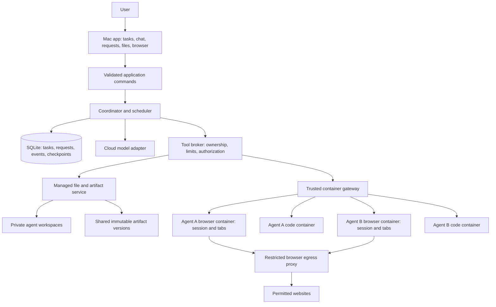
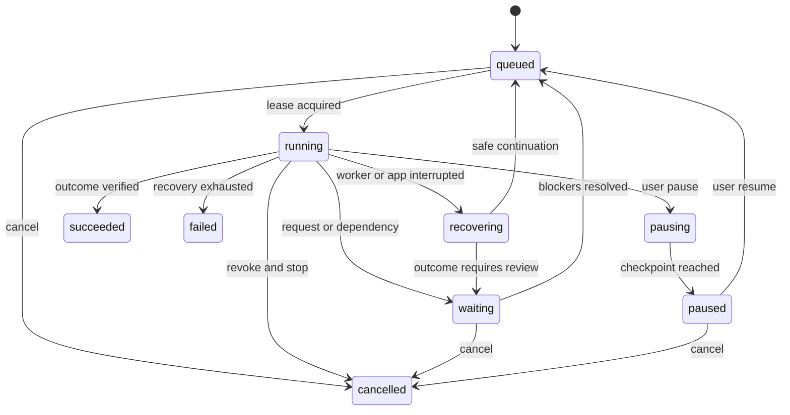

# Agent Workspaces — architecture

Planning baseline: 11 September 2026. This document specifies a proposed system; it does not describe an implemented application. “Agent Workspaces” is a working title.

## 1. Goal and confirmed decisions

Build a single-owner application where each agent can complete browser and file tasks, execute code in an isolated environment, ask the user for missing inputs, and cooperate through a shared workspace.

The user confirmed:

- The first version runs on their Mac.
- Agents use cloud model APIs first.
- Agents can execute code inside isolated containers.
- Each agent receives one browser session with multiple tabs and a private workspace.
- All agents can use a global shared workspace to discover and reuse published work.
- Agents can ask the user for files; the user supplies them through the application.

The current Mac reports `arm64`. The proposal therefore starts with Apple Silicon support. Container runtime availability and performance have not been tested.

Proposed implementation choices, open to revision: Electron + React + TypeScript; a trusted Node coordinator; SQLite; Playwright/Chromium; Docker-compatible Linux containers; two active agents initially. These choices are recommendations, not additional user requirements.

## 2. System structure



The model proposes structured actions. Only the tool broker can authorize and execute them. An agent cannot obtain a host terminal, a Docker socket, raw browser automation connection, or unrestricted filesystem API.

Website content, uploaded documents, code output, and peer-agent messages are task data. They cannot grant new tools, change sharing rules, authorize an external upload, or override the owner's instructions. Record capability grants separately from task content and enforce them at the broker.

Browser and code execution use separate containers because code should not be able to read browser login data or connect to browser debugging endpoints. A Playwright context separates web sessions; the surrounding container and broker provide the stronger resource boundary. Context isolation alone is insufficient for arbitrary code execution. [Playwright contexts](https://playwright.dev/docs/browser-contexts).

## 3. Components and responsibilities

| Component | Responsibility |
|---|---|
| Electron shell | Native file selection, application lifecycle, app windows, owner session, narrow IPC bridge |
| React interface | Task conversations, requests inbox, file library, browser viewer, execution activity |
| Coordinator | Sole database writer, task transitions, leases, checkpoints, event dispatch, cancellation |
| Model adapter | Normalized text/image/tool-call interface, streaming, provider errors and usage records |
| Tool broker | Validates every action against agent identity, run generation, resource ownership, and task permissions |
| Browser service | Owns Playwright objects inside the browser container; exposes a bounded tab API |
| Code gateway | Creates short-lived code containers, attaches output, applies limits, stops jobs |
| Artifact service | Imports files, verifies identity and scope, publishes versions, manages previews and exports |
| Event service | Durable task and artifact updates, per-agent cursors, UI notifications |
| Container runtime | Runs browser and code workloads inside the Linux VM used on macOS |

The desktop renderer loads bundled application content only. Keep Node integration disabled, context isolation and renderer sandboxing enabled, validate IPC senders, and expose explicit commands instead of generic filesystem or execution bridges. Remote websites appear as browser-worker frames, not privileged Electron pages. [Electron security guidance](https://www.electronjs.org/docs/latest/tutorial/security).

## 4. Agent, task, run, and execution

- **Agent:** durable identity, instructions, model configuration, private workspace, browser profile, tool permissions.
- **Task:** a user-requested outcome, assigned agent, attachments, dependencies, completion criteria, and conversation.
- **Run:** one attempt to advance a task, with a checkpoint, lease, fencing generation, usage, and tool records.
- **Code execution:** one command job in a disposable container. It is subordinate to a run and has its own exit status and output artifacts.

An agent can have many queued tasks but only one executing task at a time in the MVP. A waiting task releases its execution slot. The scheduler can start another task for that agent only after releasing or safely resetting browser ownership; a task needing a live browser handoff retains the session lock. Other agents continue independently.

Several agents may run at once, but each browser session has only one controller. The global scheduler separately limits model calls, browser workers, code jobs, and file-validation jobs.

## 5. Browser session design

Each agent owns one durable browser-session record and one profile volume. While active, its browser container hosts a single persistent context with many pages. Normal site cookie rules apply between tabs in that context. No default import from the user's personal Chrome profile.

The browser service assigns opaque page IDs and tracks popups, navigation, dialog state, and downloads. Agents use `tabs.list`, `tabs.open`, `page.observe`, `page.click`, `page.fill`, `page.key`, `page.scroll`, `page.upload`, and `tabs.close`. Ownership is resolved from the authenticated run, never trusted from model-supplied IDs. Multiple tabs are supported directly by Playwright. [Playwright pages](https://playwright.dev/docs/pages).

Prefer structured page observations and semantic locators. Use page screenshots and coordinate actions when necessary. Each observation has a revision; after navigation, takeover, or a stale-element failure, reacquire the page state. Keep a single action queue per session initially. Do not expose arbitrary Playwright evaluation or CDP endpoints to model-generated code.

Browser containers receive:

- A private profile volume, not mounted in code containers or shared storage.
- A private temporary download directory and a broker-controlled upload staging directory.
- No mount of the complete host filesystem, private agent workspace, or global library.
- An internal network connected only to the required browser egress service; no peer-agent connectivity.
- A bounded browser service controlled through coordinator-initiated framed stdin/stdout over the container runtime. It has no published management or debugging port.

The trusted gateway owns the runtime transport. Browser stdout contains typed responses and frames; diagnostics use a separate bounded stream. Reconnecting after a lost transport triggers worker reconciliation. Do not put generic runtime or browser-service access into the model tool schema.

Downloads are copied from browser temporary storage into managed private storage before context closure, then registered as artifacts. Playwright removes temporary downloads when their context closes. [Playwright downloads](https://playwright.dev/docs/downloads).

Login state may survive browser restarts, but open pages, JavaScript state, and expired server sessions are not guaranteed to recover. Reopen permitted URLs, reacquire page state, and request login if needed. Browser profiles and authentication state stay out of prompts, shared artifacts, and normal activity exports. [Playwright authentication](https://playwright.dev/docs/auth).

### Human browser takeover

The app displays the selected tab as screenshots or a frame stream and forwards the user's tab-scoped input to the worker. The viewport includes the current URL, tab list, and controller label. This is a browser viewport, not a remote view of the Mac desktop.

1. Coordinator revokes the agent's browser-action lease and waits for the current action to settle or marks its outcome uncertain.
2. Browser controller becomes `human`; future agent browser actions are rejected.
3. User logs in or completes the website interaction directly in that session.
4. Human keystrokes, passwords, and login frames are excluded from model context and persistent traces during takeover.
5. User selects **Return to agent**. The coordinator restores the lease, takes a fresh observation, and verifies the handoff condition.

Passkeys, native dialogs, provider-specific login restrictions, clipboard behavior, and complex keyboard input require a feasibility check. If a required site cannot be used through this viewer, keep the task waiting and record a supported handoff alternative; never silently switch to the user's personal browser session.

## 6. Container execution and network boundaries

Each code job starts from a versioned runtime image under the agent's logical environment. A fresh container is created for each job; durable files remain in the agent workspace. Start with Python and Node runtimes and an explicitly documented package set. Language processes and arbitrary shell commands execute only inside these containers.

| Resource | Code container | Browser container |
|---|---|---|
| Agent workspace | Read/write bounded `/workspace` snapshot | No complete mount |
| Shared published artifacts | Read-only `/shared` snapshot of allowed versions | Broker stages selected upload only |
| Other agents' private files | No access | No access |
| Browser login profile | No access | This agent's profile only |
| Cloud API keys | No access | No access |
| Coordinator database / Docker socket | No access | No access |
| Network | None by default | Web traffic through restricted egress |
| Root filesystem | Read-only with bounded writable temporary locations | Read-only except required profile/temp locations |

Use non-root users, dropped capabilities, `no-new-privileges`, process and memory limits, bounded temporary storage, and timeout enforcement. Do not use privileged mode, host networking, host PID namespace, host IPC, or host-wide bind mounts. Allocate private Chromium shared memory and verify it under representative load. Docker exposes runtime limits and filesystem controls; these settings need explicit integration tests. [Docker run reference](https://docs.docker.com/engine/containers/run/).

For the first release, materialize the task workspace into a size-limited `/workspace` tmpfs rather than giving arbitrary code a writable host bind mount. Start with a 512 MiB workspace and a separate 128 MiB temporary filesystem, both counted in the job's memory budget. Seed permitted task files, run the job, and stream regular output files into bounded staging through the gateway. A checked manifest commits a new private workspace revision after execution. Preserve the previous revision on interrupted export; partial outputs can be retained explicitly as incomplete. Serialize workspace edits during execution and attach newly imported user files after the revision commit. This provides a concrete capacity boundary for code writes. Larger persistent code workspaces require a quota-capable volume design in a later revision; a folder-size poll is not a hard disk quota.

Export must happen before the container stops: a trusted supervisor keeps it alive after the code payload finishes, the gateway quiesces payload descendants, and the stable workspace is exported and committed before teardown. Keep the supervisor distinct from the payload identity and validate this lifecycle in Phase 0. If quiescing or export cannot be established, fail closed and keep the last committed revision. Hard container death, including an OOM kill of the container, discards uncommitted tmpfs changes. [Docker tmpfs lifecycle](https://docs.docker.com/engine/storage/tmpfs/).

Code stdout/stderr and any manifest supplied by the payload are untrusted bytes. They cannot create authoritative events or declare successful publication. The host obtains execution status through runtime control, uses a separate status/export path, and independently validates paths, regular-file types, file counts, byte limits, and hashes before committing. Bound inode/file counts as well as total bytes. Never interpret code log output as a browser-service control frame.

A code job with networking disabled can still run through the trusted host gateway using runtime exec/stdin/stdout; it does not need a network listener. Docker's `none` network keeps only container loopback. [Docker none network](https://docs.docker.com/engine/network/drivers/none/).

Install additional dependencies by rebuilding a versioned runtime image through a controlled setup workflow. The agent can request a package; it cannot silently enable network access or download arbitrary host executables. Generic code networking is deferred until there is a task-scoped destination policy. Browser access supplies web research in the initial version.

Browser egress must be enforced outside the page: allow web protocols, deny loopback/private/link-local addresses, VM/host gateways, Docker service addresses, metadata services, and control endpoints. Apply checks to resolved destinations, redirects, subresources, and WebSocket connections; cover IPv4 and IPv6 and prevent direct proxy bypass. Revalidate destination resolution at connection time. Playwright request hooks alone are not the network boundary.

Build a browser image with a functioning Chromium sandbox and a reviewed seccomp configuration. The stock Playwright development image is not a claim of isolation for untrusted browsing. Its documentation warns about untrusted sites and notes that running the browser as root disables the Chromium sandbox. Do not “fix” sandbox startup failures using `--no-sandbox`, privileged mode, or `SYS_ADMIN`. Browser sandbox startup is a release gate. [Playwright Docker guidance](https://playwright.dev/docs/docker).

Containers reduce exposure but do not promise protection against every kernel or browser exploit. This is a single-owner local product, not an adversarial multi-tenant hosting service.

## 7. Workspace and artifact model

The user chooses an application data root during setup. Proposed logical layout:

```text
<data-root>/
  control/                 # coordinator only: database and recovery records
  private/
    <agent-id>/
      workspace/
        tasks/<task-id>/
          inputs/          # working copies of immutable imported artifacts
          work/            # scripts and intermediate work
          outputs/         # candidate deliverables
  artifacts/               # service-owned immutable original/version bytes
    private/<agent-id>/
    shared/<artifact-id>/<version-id>/
  staging/                 # incomplete imports; not visible to agents
  backups/                 # owner-configured, excludes credentials by default

Docker volumes:
  profile-<agent-id>       # only browser worker mounts this
```

The user sees **Private files** and **Shared library**, not this storage structure. A native picker or drag-and-drop imports a copy; selecting a file grants no permission to browse its containing folder. Keep original filenames as metadata and use generated storage IDs to avoid collisions.

All file tools use workspace-relative paths or artifact IDs. The file service checks agent scope, task scope where relevant, traversal, symlink escapes, and file type. Because code can mutate its workspace, safe file export cannot rely only on a preliminary `realpath` check: use race-resistant opens/no-follow traversal, reject links and special files, and copy to controlled staging before registration. Host control directories are outside all writable mounts.

Imported originals and published versions are immutable. Code receives working copies, so a script cannot corrupt the only copy of a user's upload. For shared inputs, materialize authorized versions into a per-run read-only directory before launch; do not bind a changing global library root into running containers. New publications arrive on the next refresh or execution.

Publication goes through `artifacts.publish`: copy a regular output file to staging, validate and hash it, atomically finalize bytes, then commit version metadata and an event. A reconciliation job removes abandoned staging and detects metadata/byte inconsistencies. There is no atomic transaction spanning SQLite and the filesystem, so publication must explicitly handle both crash points.

Another agent can read a shared version, fork it into private work, and publish a derived result. It cannot overwrite the original. Consumers pin version IDs and receive a notification about newer versions rather than silently swapping their inputs.

Private user uploads stay private unless the owner shares them or the task explicitly authorizes a named handoff. Publishing results derived from private inputs follows the same policy. Keep provenance and scope labels through the tool loop; default conservatively to private when any input is private. Artifact scope enforcement cannot prevent arbitrary text disclosure by itself, so cross-agent messages must follow the same task sharing policy.

## 8. Requests to the user

`request_user_input` is a first-class agent tool. Types: `files`, `clarification`, `browser_handoff`, and `permission_change` when a task needs capability outside its configured scope.

A file request includes the task, reason, named required/optional slots, accepted formats, useful content requirements, and a continuation checkpoint. Example:

```json
{
  "type": "files",
  "title": "Upload the two source files",
  "reason": "I need both periods to calculate the comparison.",
  "slots": [
    {"key": "current", "label": "Current period", "required": true, "formats": ["csv", "xlsx"]},
    {"key": "previous", "label": "Previous period", "required": true, "formats": ["csv", "xlsx"]}
  ],
  "continuation": "compare_periods",
  "scope": "private"
}
```

The coordinator binds identity and task; they are not trusted from a model-supplied payload.

### File fulfillment sequence

1. Save request, checkpoint, task blockers, and `input.requested` event together; release execution capacity.
2. Show the same request in task chat and the global requests inbox.
3. User attaches local files or selects permitted existing artifacts and maps them to slots.
4. Import into staging; check size, completion, actual type, and checksum. Do not trust a filename extension.
5. Store immutable originals and bind candidate artifact versions to the current slot revision.
6. Run bounded format/content checks in an isolated validation job. Optional model-based semantic checks use a separate validation job, so the main task need not resume just to decide whether it can resume.
7. Accept valid slots; preserve accepted inputs when another slot needs replacement. Encrypted, corrupt, or wrong-period files receive a specific explanation.
8. Mark the request fulfilled only when all required slots are accepted. Fulfillment and requeue use one database transaction and a unique resume key.
9. Resume when every blocking request/dependency is resolved and the task is not paused or cancelled.

A late upload to a cancelled task may finish importing for the owner's recovery, but cannot reactivate the task. A superseded slot revision cannot be accepted by a stale validator. Optional slots never block continuation.

Text responses use a durable `input.owner_replied` event. An answer such as “I don't have this file” permits a bounded replan job while retaining the existing blocker. The agent can revise/supersede the request, find a permitted alternative, or ask the user to accept a reduced outcome; it cannot mark absent files fulfilled. Ordinary clarification answers and capability responses follow the same revision-checked response path. Only an explicit owner grant changes capability policy.

Suggested per-slot states: `missing`, `uploading`, `checking`, `accepted`, `needs_replacement`. Request states: `open`, `partial`, `checking`, `needs_correction`, `fulfilled`, `cancelled`, `superseded`.

## 9. Durable lifecycle and coordination



Transitions not drawn, such as a fatal recovery failure, follow the same explicit state machine and audit path. `waiting_reason` is separate from task state and can include input, dependency, browser handoff, budget, or uncertain outcome. Multiple blockers can exist at once.

- Claim runnable work in a short transaction using a lease and incremented fencing generation. Only the current generation may issue tools; an old worker cannot continue after recovery.
- Record a tool call before executing it. Store request, result, artifact references, and status: `planned`, `dispatched`, `succeeded`, `failed`, or `outcome_unknown`.
- Checkpoint completed observations, summaries, next action, budgets, and consumed event cursors. Do not store hidden chain-of-thought; store actionable state and user-visible explanations.
- Commit domain changes and durable events in the same transaction. Deliver events at least once and deduplicate consumers by event ID.
- Retry reads and idempotent local operations within bounds. A browser submission with unknown outcome must be inspected before retrying; exactly-once external website effects are not guaranteed.
- Pause finishes or safely interrupts the current bounded action before checkpointing. Stop revokes future capabilities immediately and terminates cancellable jobs; it cannot undo an external action already accepted by a site.
- On app restart, reconcile expired leases, containers, pending uploads, publications, and uncertain tool actions before enabling new side effects.

SQLite uses local disk, foreign keys, WAL, and short transactions through the coordinator. WAL supports overlapping reads and writes, but still only one writer at a time; never hold a write transaction across a cloud request or container operation. Do not put this database on a network-shared directory. [SQLite WAL](https://www.sqlite.org/wal.html).

### How agents become aware of each other

The shared task board exposes owner, short shareable objective, state, dependency, and published results. Private conversations, inputs, traces, and browser pages are excluded by default.

Before each planning cycle, provide a bounded summary of relevant changes since that agent's cursor. Tools allow querying task status, reading permitted messages, discovering shared artifacts, and requesting a handoff. Read full file contents only when needed; do not append every agent's history to every prompt.

Use an acyclic task dependency graph. Reject dependency cycles. If an upstream task fails, mark the downstream blocker explicitly and notify the owner. Start with user-assigned collaboration; autonomous agent creation and unbounded delegation are later features.

## 10. Persistence schema

| Table | Essential fields and constraints |
|---|---|
| `agents` | id, name, instructions, model_config, policy_id, workspace_id, enabled |
| `tasks` | id, agent_id, objective, state, revision, waiting_reason, completion_criteria, sharing_policy |
| `runs` | id, task_id, attempt, lease_until, fencing_generation, checkpoint, usage; one active execution per agent |
| `task_messages` | id, task_id, role, content, attachment refs, timestamp |
| `browser_sessions` | id, agent_id unique, profile_ref, controller, controller_generation, lifecycle |
| `browser_tabs` | id, session_id, permitted URL, title, observation_revision, lifecycle |
| `input_requests` | id, task_id, type, state, revision, continuation_key, blocking |
| `request_slots` | id, request_id, key, required, constraints, state, candidate_version_id, revision |
| `artifacts` | id, owner_agent_id, producer_task_id, visibility, display_name |
| `artifact_versions` | id, artifact_id, storage_ref, sha256, bytes, MIME, provenance, status, created_at |
| `artifact_grants` | artifact_id/version_id, permitted agent or all-agents scope, granted_by |
| `task_dependencies` | task_id, depends_on_task_id, required_artifact_version; reject cycles |
| `agent_messages` | id, sender, recipient, task refs, shareable body, artifact refs, delivery status |
| `tool_calls` | id, run_id, generation, tool_name, args_ref, state, result_ref, idempotency_key unique |
| `code_executions` | id, tool_call_id, image_digest, argv, cwd, limits, exit_code, log_ref, lifecycle |
| `events` | increasing id, type, aggregate_id, aggregate_revision, scoped payload, timestamp |
| `event_cursors` | consumer_id, last_event_id; unique consumer |
| `resume_receipts` | request_id, fulfillment_revision, continuation_key; unique combination |

Authentication secrets belong in the macOS credential store, not this database or model context. Browser profile volumes contain sensitive login state and require separate deletion and backup decisions.

## 11. Application and agent contracts

Use typed command/query contracts over Electron IPC; worker RPC is separate and not exposed to the renderer or model.

| Surface | Representative commands |
|---|---|
| Owner app | `agents.create`, `tasks.create`, `tasks.pause`, `tasks.resume`, `tasks.cancel`, `requests.respond`, `files.import`, `artifacts.share`, `browser.takeControl`, `browser.releaseControl` |
| Agent tools | `browser.tabs.list/open/close`, `browser.observe/click/fill/scroll/key/upload`, `files.list/read/write`, `code.execute`, `artifacts.discover/read/publish`, `tasks.getStatus`, `agents.sendMessage`, `user.request` |
| Read models | Task detail, task board, request inbox, artifact provenance, tab state, bounded logs, usage |
| Events | `task.state_changed`, `input.requested`, `input.owner_replied`, `input.slot_checked`, `input.fulfilled`, `artifact.published`, `message.delivered`, `browser.controller_changed`, `execution.finished` |

Every tool has a schema, ownership check, maximum response size, timeout, cancellation rule, and retry classification. Structured errors include `missing_input`, `permission_denied`, `stale_observation`, `session_expired`, `budget_exceeded`, `execution_failed`, and `outcome_unknown`.

Cloud requests are made only by the coordinator. The UI must make clear that selected task content, file extracts, and page screenshots can be sent to the configured model provider. Retention and provider selection remain setup decisions.

## 12. Initial operational limits and scope

Proposed starting limits, subject to Phase 0 measurements: two active agents; one code job globally; up to six tabs per agent; 120-second code timeout; 1 GiB code memory; 2 GiB browser memory per agent; 512 MiB private browser shared memory; 256 process limit for code; 1 MiB displayed log output with a bounded retained log. Memory accounting must include Chromium shared memory and runtime overhead. These are limits to benchmark, not performance guarantees.

Setup requires a per-task model spend cap and active execution time/step budgets. Waiting for the user does not consume active execution time. Increasing limits is an explicit owner configuration action. If a model provider cannot report costs reliably, enforce token/request limits and label cost estimates.

MVP includes browser tabs, controlled uploads/downloads, code jobs, private files, shared versioned outputs, input requests, owner takeover, durable progress, stop, and two-agent collaboration.

Later: additional operating systems, multiple human accounts, generic network-enabled code, parallel tasks within one browser session, automatic agent spawning, live shared file editing, vector retrieval at scale, scheduled background work, and remote worker hosting. No Kubernetes, Redis, or separate vector database is needed for the proposed local MVP.

See [interface design](design.md) and [implementation plan](implementation-plan.md) for the screen specification, build order, and release gates.
